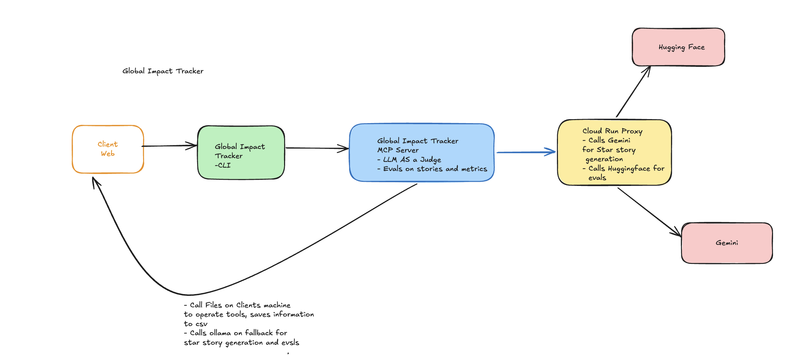

# Global Impact Tracker

[](https://github.com/ElishebaW/global-impact-tracker/actions/workflows/ci.yml)
[](https://pypi.org/project/global-impact-tracker/)
[](https://pypi.org/project/global-impact-tracker/)
[](LICENSE)

Global Impact Tracker is an open-source CLI + MCP server that transforms raw AI-assisted work into interview-ready STAR stories. Log your tasks, capture real metrics, and generate narratives grounded in actual numbers — all locally, with zero data leaving your machine. Built for engineers who want to quantify their impact and tell compelling stories in interviews.

---

## Why build this?

Engineers who use AI tools (Claude, Copilot, Gemini) consistently struggle to articulate their impact in interviews and performance reviews. Traditional metrics, lines of code, velocity points, don't capture what actually changed: the efficiency gains, the decisions made faster, the hours freed up for harder problems.

Global Impact Tracker lets you log AI-assisted work in real time, track objective metrics, and generate STAR stories grounded in actual numbers. No fabrication. No estimation. Pure data.

**Who it's for:**
- Individual engineers preparing for job interviews or performance reviews
- Technical leads quantifying team productivity
- Anyone building a portfolio that shows engineering judgment, not just code

---

## Free CLI

### Install

```bash
pip install global-impact-tracker
```

### Log a task

```bash
impact-tracker log \
  --project "Payments API" \
  --task "Refactored auth middleware to remove legacy session token storage" \
  --baseline-hrs 4.0 \
  --ai-sec 420 \
  --status "Success" \
  --task-type refactor \
  --complexity high \
  --tools-used "claude|windsurf"
```

```
Logged run to: /Users/you/.impact_tracker/global_productivity.csv
```

More examples:

```bash
# Refactoring — 8 hours of work in 3 minutes (160x speedup, $703 saved)
impact-tracker log \
  --project "User Service" \
  --task "Refactored auth middleware to use distributed session store" \
  --baseline-hrs 8.0 \
  --ai-sec 180 \
  --status "Success" \
  --task-type refactor \
  --complexity high \
  --tools-used "claude|windsurf"
```

```bash
# Feature implementation — 6 hours in 4 minutes (90x speedup, $524 saved)
impact-tracker log \
  --project "Payments" \
  --task "Built event-driven retry logic for failed transactions" \
  --baseline-hrs 6.0 \
  --ai-sec 240 \
  --status "Success" \
  --task-type feature \
  --complexity high \
  --tools-used "claude|gemini"
```

### Capture metrics

```bash
impact-tracker metrics
```

```json
{
  "queries_processed": 12,
  "total_hours_saved": 18.4,
  "latency_reduction_pct": 91.2,
  "success_rate_pct": 100.0,
  "projects_count": 3,
  "system_health": "healthy"
}
```

### Generate the dashboard

```bash
impact-dashboard
```

Opens `live_impact_dashboard.html` in the current directory — a visual breakdown of projected vs. actual hours by project.

---

## MCP Server (free for a limited time)

The paid MCP server brings AI-powered STAR story generation, decisions capture, and richer reflection directly into your AI coding environment.

**It is currently free.** Request access and a license key will be emailed to you.

### Request access

[**Request a free MCP key →**](https://forms.gle/D3mVGqnsDdf18VaM8)

You will receive a license key (`gip-...`) and full installation instructions by email, typically within 24 hours.

### Install the MCP server

```bash
pip install global-impact-tracker-mcp
```

Set the environment variables provided in your welcome email:

```bash
export IMPACT_TRACKER_LICENSE_KEY="gip-your-key-here"
export PROXY_URL="https://your-proxy-url"
export PROXY_BEARER_TOKEN="your-bearer-token"
```

### Configure your client

Pick the tab for your AI coding environment.

All three values below (`IMPACT_TRACKER_LICENSE_KEY`, `PROXY_URL`, `PROXY_BEARER_TOKEN`) are provided in your welcome email.

#### Claude Code

Add to `~/.claude/claude_desktop_config.json`:

```json
{
  "mcpServers": {
    "impact-tracker": {
      "command": "impact-tracker-mcp",
      "env": {
        "IMPACT_TRACKER_LICENSE_KEY": "gip-your-key-here",
        "PROXY_URL": "https://your-proxy-url",
        "PROXY_BEARER_TOKEN": "your-bearer-token"
      }
    }
  }
}
```

Restart Claude Code, then confirm the server is running:

```
/mcp
```

#### Codex CLI

Add to `~/.codex/config.json`:

```json
{
  "mcpServers": {
    "impact-tracker": {
      "command": "impact-tracker-mcp",
      "env": {
        "IMPACT_TRACKER_LICENSE_KEY": "gip-your-key-here",
        "PROXY_URL": "https://your-proxy-url",
        "PROXY_BEARER_TOKEN": "your-bearer-token"
      }
    }
  }
}
```

#### Gemini CLI

Add to `~/.gemini/settings.json`:

```json
{
  "mcpServers": {
    "impact-tracker": {
      "command": "impact-tracker-mcp",
      "env": {
        "IMPACT_TRACKER_LICENSE_KEY": "gip-your-key-here",
        "PROXY_URL": "https://your-proxy-url",
        "PROXY_BEARER_TOKEN": "your-bearer-token"
      }
    }
  }
}
```

#### Windsurf

Open **Settings → MCP Servers → Add Server** and enter:

| Field | Value |
|---|---|
| Name | `impact-tracker` |
| Command | `impact-tracker-mcp` |
| Env: `IMPACT_TRACKER_LICENSE_KEY` | `gip-your-key-here` |
| Env: `PROXY_URL` | `https://your-proxy-url` |
| Env: `PROXY_BEARER_TOKEN` | `your-bearer-token` |

### Sample prompts

Once the MCP server is running, paste any of these into your AI client to get started:

```
Log a task: I refactored the auth middleware today, it would have taken me about 3 hours manually but only took 8 minutes with AI
```

```
Show me my impact dashboard
```

```
Generate a STAR story for my work on the payments project — I'm preparing for a senior engineer interview
```

```
Generate a cross-project STAR story covering all my recent AI-assisted work
```

```
What engineering decisions did I make this week?
```

```
How many hours have I saved this month across all projects?
```

---

## How it works

1. **Log tasks** as you complete them — baseline hours (what it would have taken manually) and actual AI-assisted seconds.
2. **Metrics are computed locally** from your CSV log at `~/.impact_tracker/global_productivity.csv`. No data leaves your machine on the free tier.
3. **STAR stories** (paid) are generated by Gemini using your real metrics and captured engineering decisions — grounded in actual numbers, never fabricated.

---

## Deployment

### Option 1: Local (free tier)

Install via pip, run on your developer machine, no license key required. All data stays at `~/.impact_tracker/` on your machine.

```bash
pip install global-impact-tracker
```

### Option 2: MCP server (premium)

Install the companion MCP server, set your license key, configure your AI IDE. STAR story generation and LLM evals run via a Cloud Run proxy — the proxy holds API keys so you never configure upstream credentials directly.

```bash
pip install global-impact-tracker-mcp
export IMPACT_TRACKER_LICENSE_KEY="gip-your-key-here"
export PROXY_URL="https://your-proxy-url"
export PROXY_BEARER_TOKEN="your-bearer-token"
```

### Security notes

- License keys are `gip-*` format and verified locally via HMAC — no network call at startup
- No task data leaves your machine on the free tier
- The Cloud Run proxy holds Gemini and HuggingFace credentials in GCP Secret Manager; customers configure their license key, proxy URL, and bearer token — all provided at onboarding

---

## Architecture



| Component | Role |
|---|---|
| **CLI** | Logs tasks and generates the local dashboard; reads/writes `~/.impact_tracker/` on your machine |
| **MCP Server** | Runs inside your AI coding environment; orchestrates STAR story generation and LLM-as-judge evals |
| **Cloud Run Proxy** | Operator-managed service that holds Gemini and HuggingFace API keys; the MCP server authenticates to it with a bearer token |
| **Gemini** | Generates STAR stories from your real metrics |
| **HuggingFace** | Runs LLM-as-judge evals on generated stories; Ollama is the local fallback |

---

## Design decisions

### API key proxy instead of distributing keys to customers

The Cloud Run proxy holds Gemini and HuggingFace API keys in GCP Secret Manager. Customers only configure a license key — the proxy authenticates to upstream APIs on their behalf using a shared bearer token known only to the operator.

**Why not give customers direct API keys?** Distributing keys to customers means losing control of them permanently. A single compromised customer environment exposes the key for every user on the same key. There is no practical way to scope or audit usage per customer when they all hold the same credential.

**The proxy pattern gives you:** key rotation in one place without any customer action, per-license-key rate limiting and abuse detection, and a clean separation between what the customer needs to know (their license key) and what the operator needs to manage (upstream API credentials).

**Tradeoff:** An extra network hop on every LLM call, and an infrastructure component to operate and keep available. A proxy outage takes down Pro features for all users simultaneously — which is why the Ollama fallback exists for evals.

---

### HMAC license keys over a hosted auth service

License keys are self-verifiable: the MCP server checks a HMAC-SHA256 signature locally without making a network call at startup or on every tool invocation.

**Why not a hosted auth service?** A hosted auth service that goes down takes your product down with it — every customer's MCP server would fail to start until the service recovered. For a tool that runs inside a developer's IDE during active coding sessions, that failure mode is unacceptable. The MCP server becomes unreliable in exactly the moments developers rely on it most.

**The HMAC pattern gives you:** instant offline verification, zero latency on entitlement checks, and no single point of failure. The key encodes the customer ID and expiry date; the server verifies the signature without phoning home.

**Tradeoff:** Key revocation requires rotating to a new key — there is no real-time blocklist. A leaked key is valid until it expires or the customer is issued a replacement. This is an acceptable tradeoff at indie scale; a large enterprise product would need a hybrid approach with short-lived tokens and a revocation endpoint.

---

### LLM-as-judge evals over rule-based scoring

STAR story quality is evaluated by a second LLM (Llama 3.3 70B via HuggingFace, Ollama locally) rather than a deterministic rubric.

**Why not rule-based scoring?** "Is this a compelling interview story?" does not reduce to keyword matching, length checks, or metric presence tests. A story can include every number from the metrics snapshot and still be generic and forgettable. The qualities that make a STAR story effective — specific engineering decisions, a clear causal chain from action to result, language that would make a hiring manager stop scrolling — are judgment calls, not rules.

**The LLM-as-judge pattern gives you:** a scoring signal that correlates with human evaluation, a structured critique that tells the user *why* a story scored low, and the ability to improve the evaluator prompt without touching the generation pipeline.

**Tradeoff:** Non-determinism — the same story can score differently on different runs. This is mitigated by treating the score as a directional signal rather than a hard gate, and by using low temperature (0.1) to reduce variance. The deeper tradeoff is that the judge shares failure modes with the generator: both are LLMs and both can be confidently wrong.

---

### Local-first storage with CSV

Task logs are stored in a plain CSV at `~/.impact_tracker/global_productivity.csv`. No database, no server, no sync.

**Why:** The target user is a single developer tracking their own work. A CSV is inspectable in any spreadsheet, trivially portable, and requires zero infrastructure to operate or maintain. The tradeoff is that complex queries get expensive at very high row counts — but a developer would need to log thousands of tasks before that matters in practice.

---

### HMAC verification in the MCP server, not the proxy

The proxy authenticates callers with a bearer token only — it does not re-verify the customer's license key. License validation happens entirely in the MCP server before it makes any proxy call.

**Why:** The proxy is operator infrastructure; it should not need to know anything about the customer key format or signing algorithm. Centralizing entitlement logic in the MCP server keeps the proxy stateless and generic, makes it easier to test, and means a change to the licensing scheme only touches one codebase.

---

### Public/private repo split

The public `global-impact-tracker` package on PyPI contains the CLI and tracker logic. The MCP server, signing key, and proxy live in a private companion repo.

**Why:** The HMAC signing secret must never appear in a public commit — if it did, anyone could forge valid license keys. The split lets the core tracker be open source and auditable while keeping the signing secret in a controlled environment. The tradeoff is that contributors can inspect the public package but cannot run the full Pro feature stack without operator credentials.

---

## Public package boundary

The public package contains:

- shared tracker logic and CSV-backed storage
- metrics generation and the dashboard HTML generator
- the placeholder entitlement verifier interface
- the `impact-tracker` and `impact-dashboard` CLI entry points

The public package does not ship the MCP server, internal key issuance tooling, or any real signing secret. Those live in the private `global-impact-tracker-mcp` companion repo.

---

## Environment variables

| Variable | Where | Purpose |
|---|---|---|
| `IMPACT_TRACKER_LICENSE_KEY` | Customer | Activates Pro MCP features |
| `PROXY_URL` | Customer | Proxy endpoint — provided in your welcome email |
| `PROXY_BEARER_TOKEN` | Customer | Authenticates your MCP server to the proxy — provided in your welcome email |

---

## Troubleshooting

**"License key not found"** — Set `IMPACT_TRACKER_LICENSE_KEY`, `PROXY_URL`, and `PROXY_BEARER_TOKEN` in your MCP client config (all three are in your welcome email) and restart your IDE.

**"CSV file is empty"** — Check `~/.impact_tracker/`. Create it if missing:
```bash
mkdir -p ~/.impact_tracker/
```

**"MCP server won't start"** — Verify Python 3.9+. Check logs:
```bash
tail -f ~/.impact_tracker/logs/mcp.log
```

**"Can't generate STAR story"** — Requires premium tier. [Request a free key →](https://forms.gle/D3mVGqnsDdf18VaM8)

---

Built by [Mass Ave Labs](mailto:eanderson@massavelabs.com)
